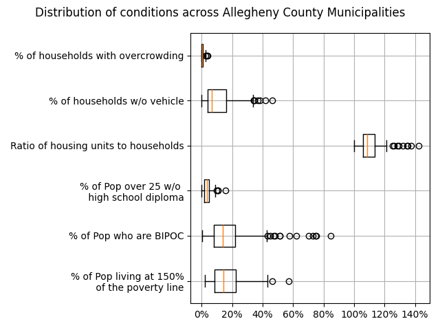
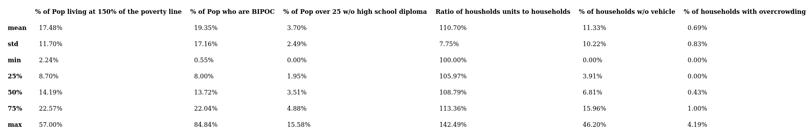
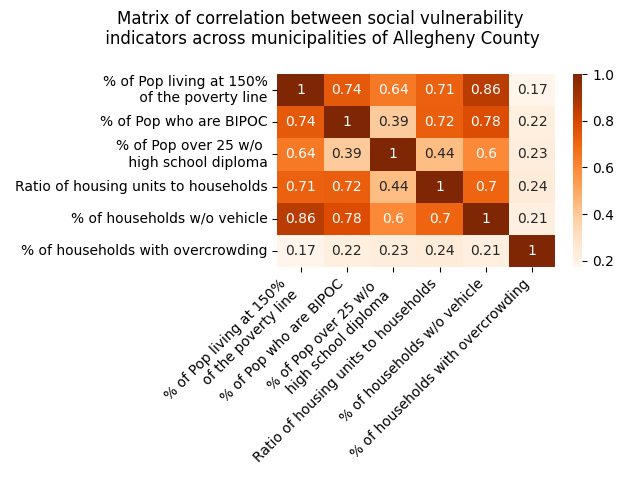
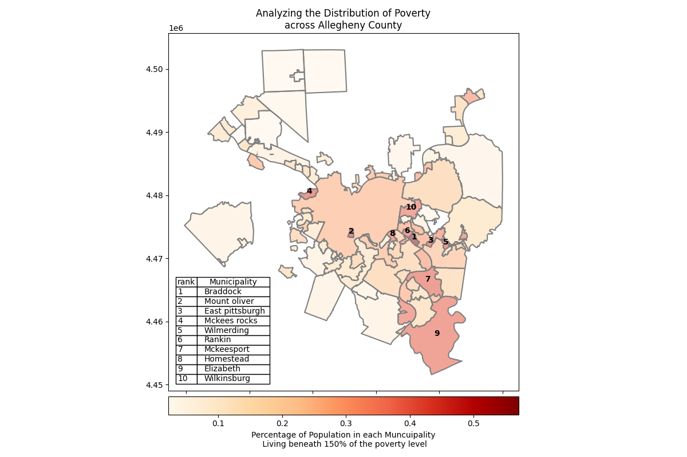
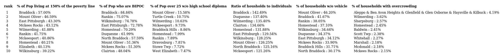

# Allegheny County, Pennsylvania 
## i-team Data Analytics Manager exercise

**TASK** : to conduct a quick baselining of social vulnerability factors in your city. Using the attached dataset of select demographic and socioeconomic variables derived from the CDC/ATSDR’s social vulnerability index, conduct an analysis of the census tracts within your city and present key insights basedon your analysis. 
For this assignment, limit the analysis to the census tracts within one of your city’s counties (e.g., all census tracts in Kings County), as identified by the ‘State’ and ‘County’ fields in the dataset. You are welcome to combine the provided data with additional data if helpful for your analysis.

### Summary
Though the analysis provided data at the census tract level, I focused my analysis on the municipal-level data. While census tracts provide a level of granularity, neighborhoods and municipalities are more meaningful to residents and end-users. 

### Methods:
 - Filtering on Allegheny County reduced the data to 380 census tracts
 - Used University of Pittsburgh's datasets of [Allegheny County]('https://pitt.libguides.com/uscensus/alleghenycotracts') and [City of Pittsburgh]('https://pitt.libguides.com/pghcensus/pghcensustracts') to map census tracts to municipalities within Allegheny County.
 - Allegheny County contains 120 municipalities.
 - Four census tracts were omitted from by the merge, due to being dropped from the 2020 census tract definitions.
 - Discovered that a handful of census tracts map to multiple municipalties. Those municipalities were combined for the sake of this analysis.

### Data (at the tract level):
The numeric variables in the dataset were:
 - Population
 - Housing Units
 - Households
 - Population living at or below the 150% poverty line
 - BIPOC Residents
 - Households with no vehicle
 - Percent of Overcrowded Housing Units
 - People 25+ w/o high school diploma
 - used the % overcrowded to calculate the number overcrowded housing units

### Aggregation (at the municiaplity level)
 - Aggregated(sum) each column at the municipality level 
 - On the municipality level, calculated:
    - Individual level:
        - Percent of population living at or below 150% the poverty line
        - Percent of population who identify as BIPOC
        - Percent of population over 25 without a high school diploma
    - Household level
        - Ratio of housing units to households
        - Percent of households w/o vehicle
        - Percent of households with overcrowding

### The average municipality

All the variables except 'Ratio of housing units to households' stay under 60% of the population. The ratio of housing units to households can be interpretted multiple ways, it shows there is more housing available than households in that municipality. The cause is uncertain, homelessness rates are not included in the dataset. Is the local housing market out of price range? Or does the condition of housing not meet the requirements for habitation?

In the "average" municipality in Allegheny County:
 - 17% of the population lives at 150% if the poverty level
 - 19% of the population identifies as a BIPOC
 - 3.7% of the population is over 25 is without a diploma
 - There is 10% more housing than needed
 - 11% of the households are without a car
 - But under 1% of households report being overcrowded

The mean would not be the best metric, as most of these distributions have a long right tail. The median would be a better indicator, as shown in descriptive summary.

## Vulnerability Indicators are highly correlated

The relationships between these indicators is uniformly high, except the percent reporting overcrowding(see correlation matrix). Since the Percent Living under the 150% poverty level has the highest across the other variables, I chose to use percent under 150% the poverty level as a proxy for the general state of the municipality.

### Mapping Poverty

The munipalities with the highest level of poverty are Braddock, Mount Oliver, East Pittsburgh, and McKees Rocks.
 

## Municipalities with highest need

The correlation between variables is easily seen in the data. Braddock, Homestead, Wilmerding, and Wilkinsburgh show up repeatedly in the top 10 municipalities for each metric.

With more time, I would develop a metric that includes the size of the municipality's  population when prioritizing the needs of each municipality. 